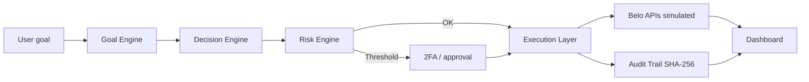

<div align="center">

# AgenticBank for Belo

**From Digital Banking to Agentic Banking.**

[](https://github.com/srbisnes/AgenticBank-for-Belo)
[](https://github.com/srbisnes/AgenticBank-for-Belo)
[](LICENSE)

[Investor deck](docs/investors/index.html) · [Brief](docs/investors/INVESTOR_BRIEF.en.md) · [Architecture](docs/ARCHITECTURE.md) · [Roadmap](ROADMAP.md) · [Español](README.md)

</div>

---

> **Notice:** Independent prototype. Not an official Belo product. No partnership or agreement with Belo exists. No real money is moved. Belo APIs are simulated. All projections are **planning hypotheses, not results**.

---

## Problem

LatAm users face multiple currencies, inflation, international payments, manual financial management, complex treasury operations and fragmented tools. Current banking apps provide access; AgenticBank proposes autonomous execution.

## Solution

Multi-agent financial operating system that analyses financial behaviour, understands goals, creates strategies, recommends actions and executes approved operations through Belo APIs (simulated).



## Features

| Module | Description |
|--------|-------------|
| Financial Copilot | Natural language: “How much did I save?”, “Create a savings strategy” |
| Goal Engine | Goals → multi-step execution plans |
| Rules Engine | e.g. income → 20% savings / 20% tax / 60% available |
| Autonomous payments | Savings, FX, treasury, bills (within approved rules) |
| Treasury Agent | 30–90 day cash flow, FX, batch payments |
| Dashboard | Net Worth, Cash Flow, ADF, Goals, recommendations |

**Agents:** Freelancer · Travel · Family Remittance · Treasury · Investment & Yield

## ADF — Autonomous Decision Factor

ADF = AI-executed decisions / Total financial decisions

Targets (hypothesis): Year 1 → 20% · Year 2 → 40% · Year 3 → 60%

## Layered architecture

```mermaid
flowchart TB
  subgraph Frontend
    WA[Web App]
    MA[Mobile App]
    AC[Agent Chat]
  end
  subgraph AI Layer
    FC[Financial Copilot]
    GE[Goal Engine]
    DE[Decision Engine]
    RE[Risk Engine]
    OR[Multi-Agent Orchestrator]
  end
  subgraph Execution
    PAY[Payments / PIX / FX / Cards]
  end
  subgraph Belo
    API[Integration Layer — simulated]
  end
  Frontend --> AI Layer
  AI Layer --> Execution
  Execution --> Belo
```

## Example: USD 2,500 income

1. Event `income_received` USD 2,500.
2. Rules Engine applies **income-20-20-60**.
3. Risk Engine evaluates (simulated score 98/100).
4. If threshold exceeded → 2FA.
5. Execution Layer allocates:
   - `BELO_VAULT_SWEEP` → 500
   - `BELO_TAX_ISOLATION_ESCROW` → 500
   - `AVAILABLE_BALANCE` → 1,500
6. Audit Trail generates SHA-256 receipt.
7. ADF updates.

Run locally: `npx tsx examples/demo.ts`

## Screenshots

| | | |
|---|---|---|
|  |  | |
|  |  | |

TODO(owner): prototype screenshots.

## Investor materials

[Open interactive deck](docs/investors/index.html) · [Brief ES](docs/investors/INVESTOR_BRIEF.md) · [Brief EN](docs/investors/INVESTOR_BRIEF.en.md)

## Try the app

**Live demo:** TODO(owner): live demo link.

**Local examples:**

```bash
git clone https://github.com/srbisnes/AgenticBank-for-Belo.git
cd AgenticBank-for-Belo
cp .env.example .env
# Full app is exported from Google AI Studio (Export → GitHub or ZIP).
# Rules/audit/ADF examples:
npx tsx examples/demo.ts
```

Reference port for the prototype: 3000.

## Stack

React · TypeScript · Express (`server.ts`) · `@google/genai` (Gemini) · sample data throughout the prototype.

## Two-stage plan (hypothesis)

**Months 1–12:** validate and fund (demo, grants, Belo sandbox, beta 100–500 users, ADF ≥ 20%).

**Months 13–18:** minimal subscription (Free / Pro / Business), 5–10 paying pilot companies, ADF ≥ 25%.

See [ROADMAP.md](ROADMAP.md) and [docs/FUNDING_PLAN.md](docs/FUNDING_PLAN.md).

## Projections (planning hypotheses, not results)

| Scenario | Users | GPV | ARR |
|----------|-------|-----|-----|
| Conservative | 400,000 | USD 2B | USD 12M |
| Base | 1M | USD 5B | USD 30M |
| Optimistic | 2M | USD 10B | USD 60M |

## Security

Prototype with no real funds. Report via the Security tab. Never commit secrets. Everything goes through the Risk Engine. User-approved limits. See [SECURITY.md](SECURITY.md).

The design contemplates compliance matrices per jurisdiction. **Legal review is required before operating with real funds.**

## Contributing

See [CONTRIBUTING.md](CONTRIBUTING.md). Areas: Rules Engine tests, new agents, per-country compliance docs, accessibility.

## Author

**Srbisnes** (elcryptoboy) — omnichain blockchain architect and AI agent-swarm builder, Buenos Aires.

## Ecosystem & Related Projects

- [Stellar Agent Layer](https://github.com/srbisnes/stellar-agent-layer): AI Agent Layer + Intent Engine + Human-in-the-Loop on Stellar Testnet for multi-currency settlement, payments, and USDC → ARS off-ramp.

## License

MIT © 2026 Srbisnes
