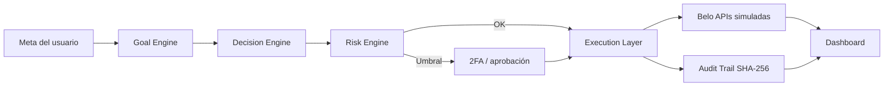

<div align="center">

# AgenticBank for Belo

**From Digital Banking to Agentic Banking.**

[](https://github.com/srbisnes/AgenticBank-for-Belo)
[](https://github.com/srbisnes/AgenticBank-for-Belo)
[](LICENSE)

[Presentación inversores](docs/investors/index.html) · [Brief](docs/investors/INVESTOR_BRIEF.md) · [Arquitectura](docs/ARCHITECTURE.md) · [Roadmap](ROADMAP.md) · [English](README.en.md)

</div>

---

> **Aviso:** Prototipo independiente. No es un producto oficial de Belo. No existe alianza ni acuerdo con Belo. No mueve dinero real. Las APIs de Belo están simuladas. Toda proyección es **hipótesis de planificación, no resultados**.

---

## Problema

Usuarios de LatAm enfrentan múltiples monedas, inflación, pagos internacionales, gestión financiera manual, operaciones de tesorería complejas y herramientas fragmentadas. Las apps bancarias actuales dan acceso; AgenticBank propone ejecución autónoma.

## Solución

Sistema operativo financiero multi-agente que: analiza el comportamiento financiero, entiende metas, crea estrategias, recomienda acciones y ejecuta operaciones aprobadas a través de las APIs de Belo (simuladas).



## Funcionalidades

| Módulo | Descripción |
|--------|-------------|
| Financial Copilot | Lenguaje natural: “¿cuánto ahorré?”, “creá una estrategia de ahorro” |
| Goal Engine | Metas → planes de ejecución multi-paso |
| Rules Engine | Ej. ingreso → 20% ahorro / 20% impuestos / 60% disponible |
| Pagos autónomos | Ahorro, FX, tesorería, facturas (dentro de reglas aprobadas) |
| Treasury Agent | Flujo de caja 30–90 días, FX, pagos por lote |
| Dashboard | Net Worth, Cash Flow, ADF, Goals, recomendaciones |

**Agentes:** Freelancer · Travel · Family Remittance · Treasury · Investment & Yield

## ADF — Autonomous Decision Factor

ADF = Decisiones de IA ejecutadas / Decisiones financieras totales

Metas (hipótesis): Año 1 → 20% · Año 2 → 40% · Año 3 → 60%

## Arquitectura por capas

```mermaid
flowchart TB
  subgraph Frontend
    WA[Web App]
    MA[Mobile App]
    AC[Agent Chat]
  end
  subgraph AI Layer
    FC[Financial Copilot]
    GE[Goal Engine]
    DE[Decision Engine]
    RE[Risk Engine]
    OR[Multi-Agent Orchestrator]
  end
  subgraph Execution
    PAY[Payments / PIX / FX / Cards]
  end
  subgraph Belo
    API[Integration Layer — simulada]
  end
  Frontend --> AI Layer
  AI Layer --> Execution
  Execution --> Belo
```

## Ejemplo: cobro de USD 2.500

1. Evento `income_received` USD 2.500.
2. Rules Engine aplica **income-20-20-60**.
3. Risk Engine evalúa (puntaje simulado 98/100).
4. Si supera umbral → 2FA.
5. Execution Layer asigna:
   - `BELO_VAULT_SWEEP` → 500
   - `BELO_TAX_ISOLATION_ESCROW` → 500
   - `AVAILABLE_BALANCE` → 1.500
6. Audit Trail genera recibo SHA-256.
7. ADF se actualiza.

Ejecutá localmente: `npx tsx examples/demo.ts`

## Capturas

| | | |
|---|---|---|
|  |  | |
|  |  | |

TODO(owner): capturas de pantalla del prototipo.

## Presentación para inversores

[Abrir presentación interactiva](docs/investors/index.html) · [Brief ES](docs/investors/INVESTOR_BRIEF.md) · [Brief EN](docs/investors/INVESTOR_BRIEF.en.md)

## Probar la app

**Demo en vivo:** TODO(owner): link de la demo en vivo.

**Instalación local del prototipo de ejemplos:**

```bash
git clone https://github.com/srbisnes/AgenticBank-for-Belo.git
cd AgenticBank-for-Belo
cp .env.example .env
# La app completa se exporta desde Google AI Studio (Export → GitHub o ZIP).
# Los ejemplos de rules/audit/ADF:
npx tsx examples/demo.ts
```

Puerto de referencia del prototipo: 3000.

## Stack

React · TypeScript · Express (`server.ts`) · `@google/genai` (Gemini) · datos de ejemplo en todo el prototipo.

## Plan en dos etapas (hipótesis)

**Meses 1–12:** validar y financiar (demo, grants, sandbox Belo, beta 100–500 usuarios, ADF ≥ 20%).

**Meses 13–18:** suscripción mínima (Free / Pro / Business), empresas piloto 5–10 pagando, ADF ≥ 25%.

Ver [ROADMAP.md](ROADMAP.md) y [docs/FUNDING_PLAN.md](docs/FUNDING_PLAN.md).

## Proyecciones (hipótesis de planificación, no resultados)

| Escenario | Usuarios | GPV | ARR |
|-----------|----------|-----|-----|
| Conservador | 400.000 | USD 2B | USD 12M |
| Base | 1M | USD 5B | USD 30M |
| Optimista | 2M | USD 10B | USD 60M |

## Seguridad

Prototipo sin fondos reales. Reportes vía pestaña Security. Nunca subir claves. Todo pasa por Risk Engine. Límites aprobados por el usuario. Ver [SECURITY.md](SECURITY.md).

El diseño contempla matrices de compliance por jurisdicción. **Requiere revisión legal antes de operar con fondos reales.**

## Contribuir

Ver [CONTRIBUTING.md](CONTRIBUTING.md). Áreas: tests del Rules Engine, nuevos agentes, compliance por país, accesibilidad.

## Autor

**Srbisnes** (elcryptoboy) — arquitecto blockchain omnichain y constructor de enjambres de agentes de IA, Buenos Aires.

## Ecosistema y proyectos relacionados

- [Stellar Agent Layer](https://github.com/srbisnes/stellar-agent-layer): Capa de agentes de IA + Intent Engine + Human-in-the-Loop en Stellar Testnet para liquidación multi-moneda, pagos y off-ramp USDC → ARS.

## Licencia

MIT © 2026 Srbisnes
