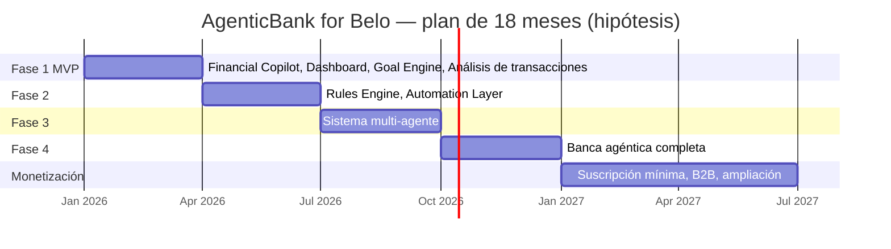

# Roadmap

Hipótesis de planificación. No son resultados.

## Vista Gantt (18 meses)

## Checklist por fase

### Fase 1 — Financial Copilot, Dashboard, Goal Engine, Transaction Analysis

- [x] Dashboard ejecutivo multimoneda (USD, USDT, BRL/PIX, ARS/CVU, MXN/SPEI, COP)
- [x] Financial Copilot conversacional con Gemini (lado servidor)
- [x] Goal Engine con planes multi-paso e identificadores de rieles simulados
- [x] Medidor ADF con hitos Año 1/2/3 y simulador de proyecciones
- [x] Pronóstico visual de flujo de caja a 30 días (datos de ejemplo)
- [ ] Integración real con APIs de Belo (actualmente simulada)

### Fase 2 — Rules Engine, Automation Layer

- [x] Rules Engine (income 20/20/60, ARS devaluation shield, reglas de tarjeta y remesas)
- [x] Simulador de cobro con rebalanceo y entradas de auditoría
- [ ] Automatización recurrente en producción (hoy solo prototipo)

### Fase 3 — Sistema multi-agente

- [x] Orquestador multi-agente: Freelancer, Travel, Family Remittance, Treasury, Investment & Yield
- [x] Controles de límite de autonomía, umbrales de 2FA, disparadores
- [x] Auditoría: recibos SHA-256, puntaje de riesgo simulado, killswitch
- [x] Consola de API: explorador OpenAPI de `/api/belo/execute` (simulado)
- [ ] Despliegue multi-tenant y políticas por organización

### Fase 4 — Banca agéntica completa

- [ ] Ejecución real a través de infraestructura regulada de Belo
- [ ] Panel de permisos transparente en producción
- [ ] Matrices de compliance operativas por jurisdicción (hoy diseño + revisión legal pendiente)
- [ ] API pública y SDK

### Monetización (meses 13–18, hipótesis)

- [ ] Planes Free / Pro / Business (precios a validar)
- [ ] 20–50 empresas piloto; 5–10 pagando
- [ ] ADF ≥ 25% y usuarios activos 1.000–3.000 (metas de planificación)

## Señales de éxito (plan 18 meses)

| Trimestre | Foco | Señal |
|-----------|------|-------|
| T1 (M1–3) | Demo pública, pitch, hackatones | 50 conversaciones con usuarios; 1 contacto con el equipo de Belo |
| T2 (M4–6) | Financiamiento no dilutivo | 5+ aplicaciones a grants/hackatones; al menos 1 financiamiento o premio |
| T3 (M7–9) | Piloto técnico sandbox + lista de espera | 300 en lista de espera |
| T4 (M10–12) | Beta cerrada 100–500 usuarios | ADF ≥ 20%; retención a 30 días medida |
| M13–18 | Suscripción y B2B | 5–10 empresas pagando; ADF ≥ 25% |
