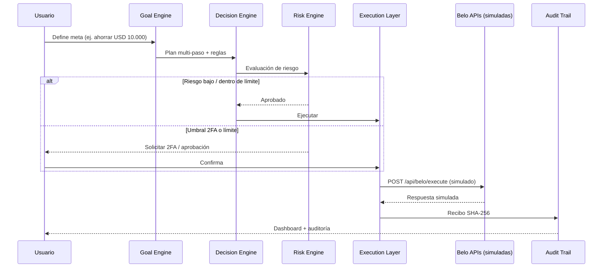

# Arquitectura

## Principios

1. **Intención en lugar de instrucción** — el usuario define metas; los agentes proponen y ejecutan dentro de reglas aprobadas.
2. **Seguridad por capas** — Risk Engine, umbrales de 2FA, límites de autonomía y killswitch.
3. **Todo auditable** — recibos criptográficos SHA-256 encadenados por decisión.
4. **El usuario manda** — aprueba, limita y puede frenar en cualquier momento.

## Diagrama de secuencia (flujo meta → ejecución)



## Componentes

| Capa | Componentes | Rol |
|------|-------------|-----|
| Frontend | Web App, Mobile App, Agent Chat | Interfaz, metas, dashboard |
| AI Layer | Financial Copilot, Goal Engine, Decision Engine, Memory Layer, Risk Engine, Multi-Agent Orchestrator | Análisis, planificación, decisión y riesgo |
| Agentes | Freelancer, Travel, Family, Treasury, Investment | Especialización por caso de uso |
| Execution Layer | Payments, Transfers, PIX, Stablecoins, FX, Cards | Rieles de ejecución |
| Belo Integration | Capa de integración desacoplada | APIs simuladas en el prototipo |
| Audit | SHA-256 chain, Risk score, Compliance matrices (diseño) | Trazabilidad |

## Endpoint simulado

`POST /api/belo/execute` — **solo simulado en el prototipo**.

**Request (ejemplo):**

```json
{
  "intent": "allocate_income",
  "amount": 2500,
  "currency": "USD",
  "rules": ["income-20-20-60"],
  "agent": "Freelancer"
}
```

**Response (ejemplo simulado):**

```json
{
  "status": "simulated_ok",
  "allocations": {
    "BELO_VAULT_SWEEP": 500,
    "BELO_TAX_ISOLATION_ESCROW": 500,
    "AVAILABLE_BALANCE": 1500
  },
  "audit_hash": "sha256:...",
  "risk_score": 98
}
```

## Compliance y privacidad

El diseño contempla matrices de compliance por jurisdicción (Brasil — Banco Central / PIX; Argentina — BCRA / CVU-CBU; México — Banxico / SPEI) y privacidad de datos.

**Requiere revisión legal antes de operar con fondos reales.** Este documento no constituye asesoramiento legal ni financiero. El prototipo no afirma cumplimiento regulatorio.
